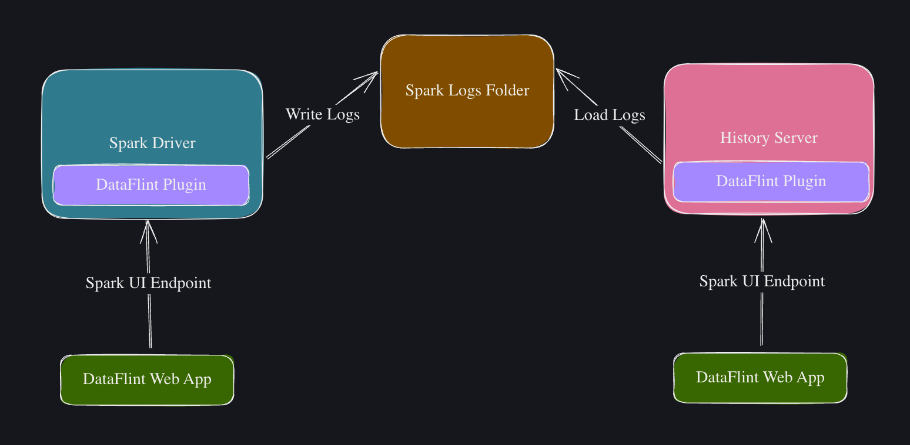

<p align="center">

</p>

<h2 align="center">
 Spark Performance Made Simple
</h2>

<div align="center">

[](https://maven-badges.herokuapp.com/maven-central/io.dataflint/spark_2.12)
[](https://join.slack.com/t/dataflint/shared_invite/zt-28sr3r3pf-Td_mLx~0Ss6D1t0EJb8CNA)
[](https://github.com/your_username/your_repo/actions/workflows/tests.yml)
[](https://dataflint.gitbook.io/dataflint-for-spark/)


If you enjoy DataFlint OSS please give us a ⭐️ and join our [slack community](https://join.slack.com/t/dataflint/shared_invite/zt-28sr3r3pf-Td_mLx~0Ss6D1t0EJb8CNA) for feature requests, support and more!

</div>

## What is DataFlint OSS?

DataFlint OSS is a modern, user-friendly enhancement for Apache Spark that simplifies performance monitoring and debugging. It adds an intuitive tab to the existing Spark Web UI, transforming a powerful but often overwhelming interface into something easy to navigate and understand.

**Looking for more?** Our full solution is a Production-aware AI copilot for Apache Spark. Learn more at [dataflint.io](https://www.dataflint.io/).

## Why DataFlint OSS?

- **Intuitive Design**: DataFlint OSS's tab in the Spark Web UI presents complex metrics in a clear, easy-to-understand format, making Spark performance accessible to everyone.
- **Effortless Setup**: Install DataFlint OSS in minutes with just a few lines of code or configuration, without making any changes to your existing Spark environment.
- **For All Skill Levels**: Whether you're a seasoned data engineer or just starting with Spark, DataFlint OSS provides valuable insights that help you work more effectively.

With DataFlint OSS, spend less time deciphering Spark Web UI and more time deriving value from your data. Make big data work better for you, regardless of your role or experience level with Spark.


### Usage

After installation, you will see a "DataFlint OSS" tab in the Spark Web UI. Click on it to start using DataFlint OSS.


## Demo ([Full YouTube Walkthrough](https://youtu.be/4d_jBCmodKQ?si=VGwFORzw6Wm4vkDo))


## Features

- 📈 Real-time query and cluster status
- 📊 Query breakdown with performance heat map
- 📋 Application Run Summary
- ⚠️ Performance alerts and suggestions
- 👀 Identify query failures
- 🤖 Spark AI Assistant

See [Our Features](https://dataflint.gitbook.io/dataflint-for-spark/overview/our-features) for more information

## Installation

### Scala

Install DataFlint OSS via sbt:
```sbt
libraryDependencies += "io.dataflint" %% "spark" % "0.2.3"
```

Then instruct spark to load the DataFlint OSS plugin:
```scala
val spark = SparkSession
    .builder()
    .config("spark.plugins", "io.dataflint.spark.SparkDataflintPlugin")
    ...
    .getOrCreate()
```

### PySpark
Add these 2 configs to your pyspark session builder:

```python
builder = pyspark.sql.SparkSession.builder
    ...
    .config("spark.jars.packages", "io.dataflint:spark_2.12:0.2.3") \
    .config("spark.plugins", "io.dataflint.spark.SparkDataflintPlugin") \
    ...
```

### Spark Submit

Alternatively, install DataFlint OSS with **no code change** as a spark ivy package by adding these 2 lines to your spark-submit command:

```bash
spark-submit
--packages io.dataflint:spark_2.12:0.2.3 \
--conf spark.plugins=io.dataflint.spark.SparkDataflintPlugin \
...
```

### Additional installation options

* There is also support for scala 2.13, if your spark cluster is using scala 2.13 change package name to io.dataflint:spark_**2.13**:0.2.3
* For more installation options, including for **python** and **k8s spark-operator**, see [Install on Spark docs](https://dataflint.gitbook.io/dataflint-for-spark/getting-started/install-on-spark)
* For installing DataFlint OSS in **spark history server** for observability on completed runs see [install on spark history server docs](https://dataflint.gitbook.io/dataflint-for-spark/getting-started/install-on-spark-history-server)
* For installing DataFlint OSS on **DataBricks** see [install on databricks docs](https://dataflint.gitbook.io/dataflint-for-spark/getting-started/install-on-databricks)

## How it Works



DataFlint OSS is installed as a plugin on the spark driver and history server.

The plugin exposes an additional HTTP resoures for additional metrics not available in Spark UI, and a modern SPA web-app that fetches data from spark without the need to refresh the page.

For more information, see [how it works docs](https://dataflint.gitbook.io/dataflint-for-spark/overview/how-it-works)

## Medium Articles

*  [Fixing small files performance issues in Apache Spark using DataFlint OSS](https://medium.com/@menishmueli/fixing-small-files-performance-issues-in-apache-spark-using-dataflint-49ffe3eb755f)

*  [Are Long Filter Conditions in Apache Spark Leading to Performance Issues?](https://medium.com/@menishmueli/are-long-filter-conditions-in-apache-spark-leading-to-performance-issues-0b5bc6c0f94a)

*  [Optimizing update operations to Apache Iceberg tables using DataFlint OSS](https://medium.com/dev-genius/optimizing-update-operations-to-apache-iceberg-tables-using-dataflint-e4e372e75b8a)

*  [Did you know that your Apache Spark logs might be leaking PIIs?](https://medium.com/system-weakness/did-you-know-that-your-apache-spark-logs-might-be-leaking-piis-06f2a0e8a82c)

*  [Cost vs Speed: measuring Apache Spark performance with DataFlint OSS](https://medium.com/@menishmueli/cost-vs-speed-measuring-apache-spark-performance-with-dataflint-c5f909ebe229)


## Compatibility Matrix

DataFlint OSS require spark version 3.2 and up, and supports both scala versions 2.12 or 2.13. 


| Spark Platforms           | DataFlint OSS Realtime  | DataFlint OSS History server |
|---------------------------|---------------------|--------------------------|
| Local                     |       ✅            |           ✅             |
| Standalone                |       ✅            |           ✅             |
| Kubernetes Spark Operator |       ✅            |           ✅             |
| EMR                       |       ✅            |           ✅             |
| Dataproc                  |       ✅            |           ❓             |
| HDInsights                |       ✅            |           ❓             |
| Databricks                |       ✅            |           ❌             |

For more information, see [supported versions docs](https://dataflint.gitbook.io/dataflint-for-spark/overview/supported-versions)